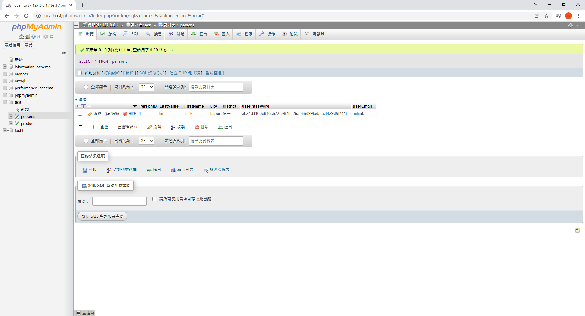

<h1>Web實作概覽</h1>
<h3>PHP連結&nbsp;MySQL資料庫&nbsp;有商品CRUD 功能+RWD設計實作</h3> 
<h3>12/20 的 YouTube 演示作品:<a href="https://youtu.be/CweuNMnHmNU"> https://youtu.be/CweuNMnHmNU</a></h3>
<h5>新功能每日增加中...</h5>
<h3>1.註冊功能 and RWD 示範 (CSS+Bootstrap)</h3>
<h3>2.驗證信功能 (MySQL+PHP+JavaScript+PHPMailer技術)</h3>
<h3>&nbsp; 密碼加密進資料庫 (資安)</h3>
<h3>&nbsp; 驗證信給token</h3>
<h3>3.PHP 連線資料庫 做操作</h3>
<h3>4.Ajax_Axios 連線資料庫做操作(AJAX)</h3>
<h3>5.購物車示範 (COOKIE)</h3>

<h3>首頁</h3>
 

<h3>會員註冊 帳密Hash進資料庫</h3> 

 

