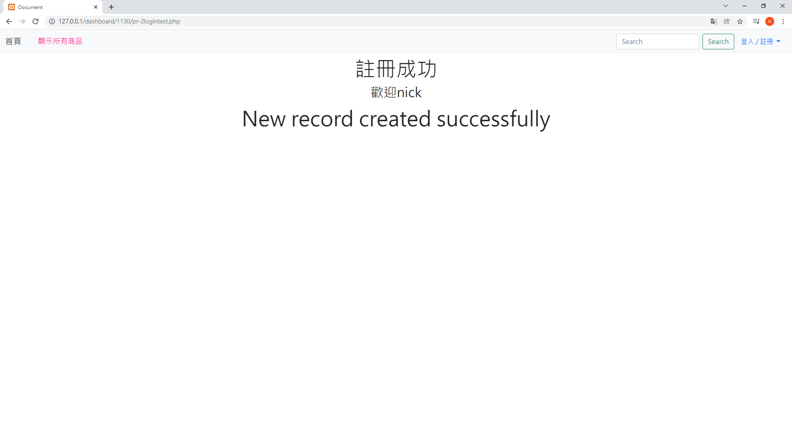

<h1>Web實作概覽</h1>
<h3>PHP連結&nbsp;MySQL資料庫&nbsp;有商品CRUD 功能+RWD設計實作</h3> 
<h3>12/10的YouTube演示作品...更新中...</h3>
<h3>12/06的YouTube演示作品:<a href="https://www.youtube.com/watch?v=0FekRGVR204&t=211s"> https://www.youtube.com/watch?v=0FekRGVR204&t=211s</a></h3>
<h3>首頁</h3>
 
<h3>會員註冊_1 選右上方選單</h3> 
 
<h3>會員註冊_2 填註冊表單</h3> 

 
<h3>會員註冊_2 帳密Hash進資料庫</h3> 

 

<h3>會員註冊_3 會員註冊成功</h3> 
 
